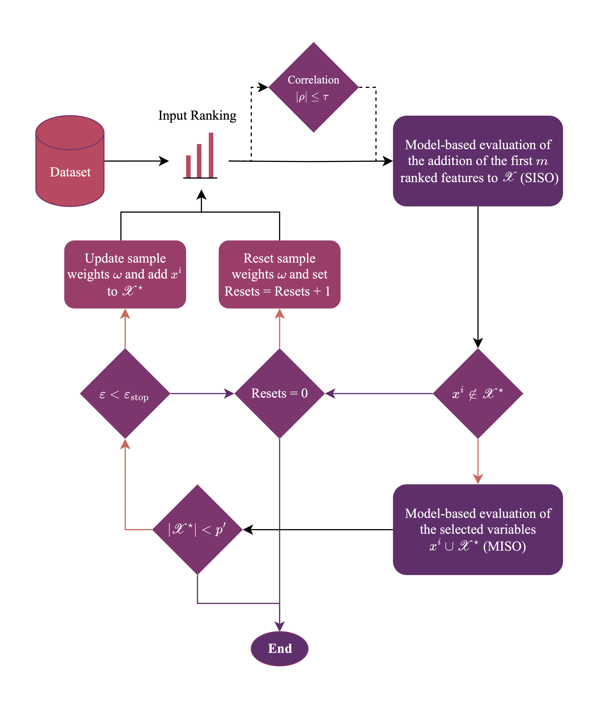

# SHAPBoost
Python implementation of SHAPBoost. See the [paper]() for details.


## Usage
```shell
pip install shapboost
```

### Example
```python
from shapboost import SHAPBoostRegressor

clf = SHAPBoostRegressor()
clf.fit(X, y)
print(clf.selected_subset_)
```
For a more detailed example, see the [regression example](examples/example_regression.py).

## Feature selection methods
SHAPBoost is available for regression, and survival problems.
- Regression supports the `mae`, `mse`, and `r2` objectives through the `SHAPBoostRegressor`-class and can be optimized through `adaptive` boosting.
- Survival supports the `c_index` objective through the `SHAPBoostRegressor`-class and can be optimized through `adaptive` boosting.

# Important notes
- The `estimator` hyperparameter sets the estimators used for the SISO- and MISO steps, and for the updating of the
sample weights (or the boosting), the first estimator is used. Thus, this first estimator needs to be a tree model that
supports the `sample_weight` parameter.

# Illustration of SHAPBoost

